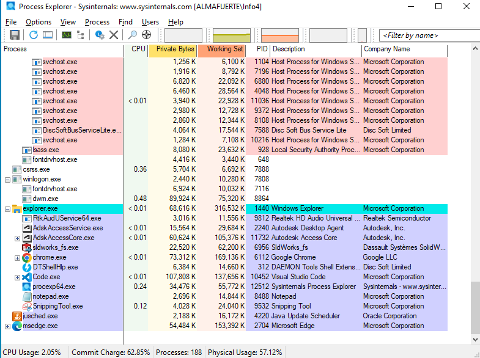
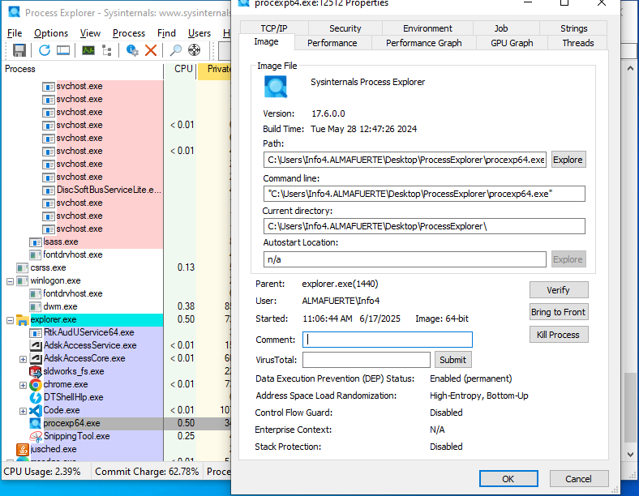
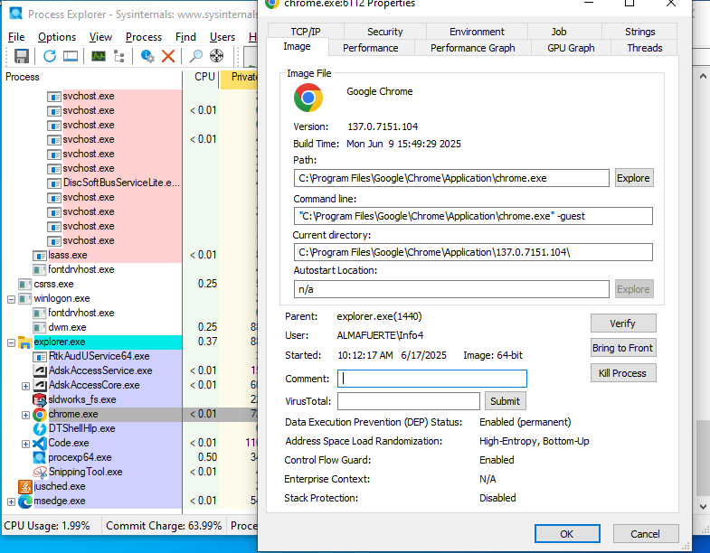
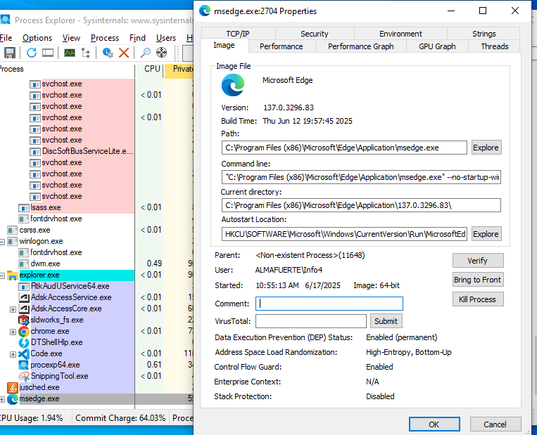
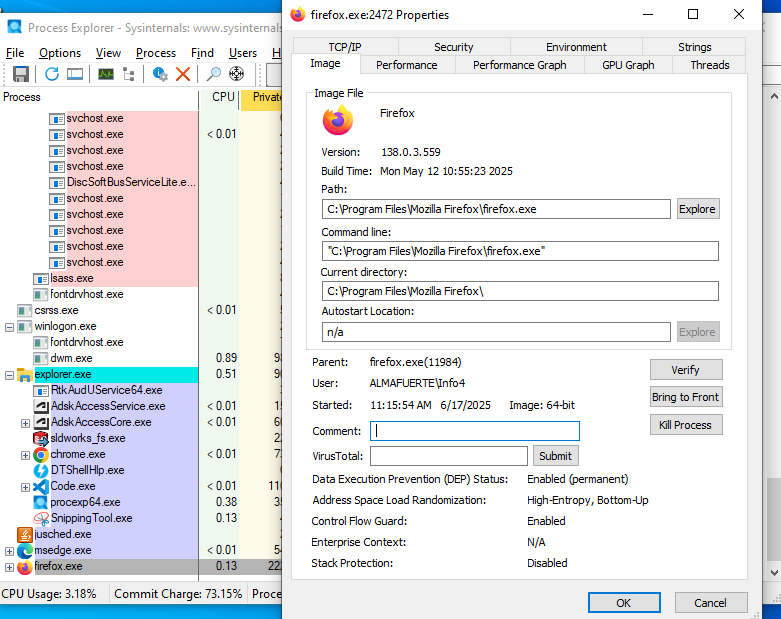
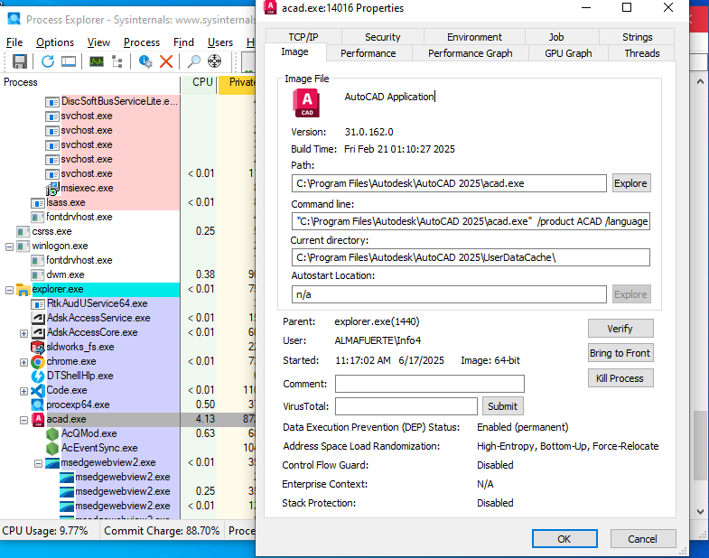

# Tarea: Procesos - Process Explorer

Para la realización de las siguientes prácticas deberemos instalar en el Sistema la herramienta Process Explorer:

[Process Explorer](https://docs.microsoft.com/en-us/sysinternals/downloads/process-explorer#download)

Se trata de un software desarrollado por SysInternals y que fué comprado por Microsoft y ahora se ofrece de manera gratuita desde la página de Microsoft.

## Ejercicio 1

Lanza el Bloc de Notas y el Edge, abre el Process Explorer y comprueba que los procesos han sido lanzados y están en marcha.

Realiza una captura de pantalla.

 

## Ejercicio 2

Utilizando la opción de menú *Propiedades* sobre notepad.exe, obtén los siguientes datos acerca del ejecutable del Bloc de Notas.

* Path
* Linea de ejecución
* Directorio actual
* Usuario que lo ha lanzado
* Proceso que lo ha lanzado (padre)
* Versión

## Ejercicio 3

Obtén los mismos datos de 4 programas conocidos. Puedes realizar esta tarea en casa.

\
